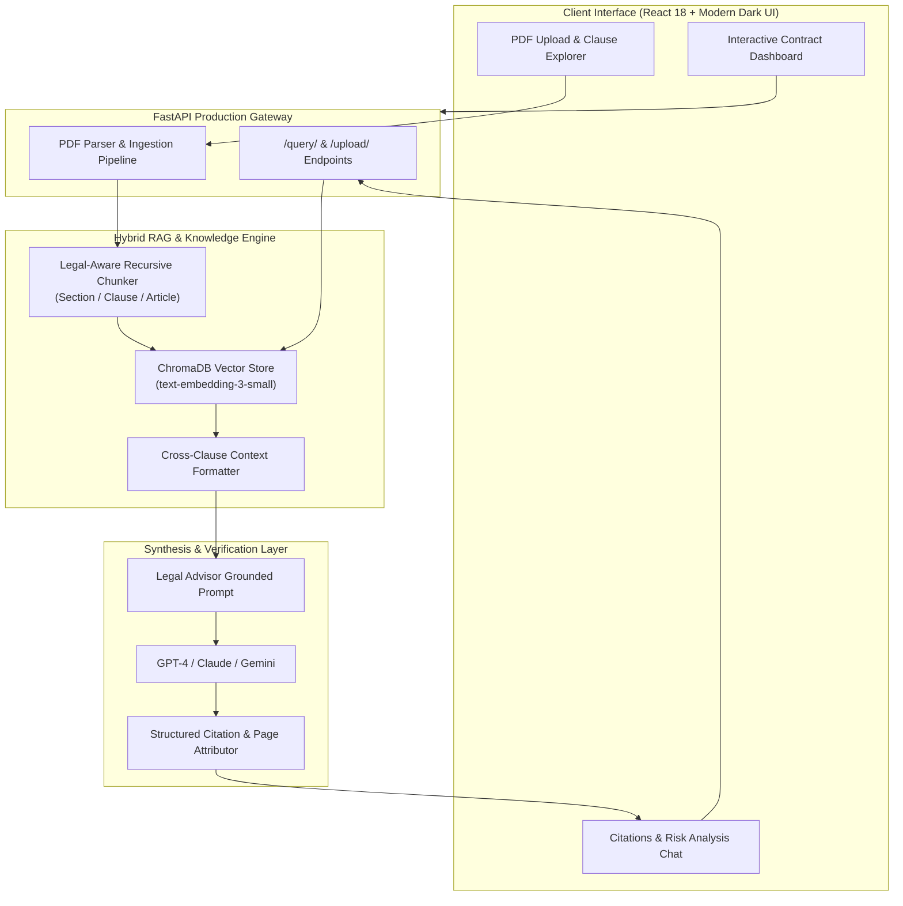

<div align="center">

# ⚖️ LexiRAG (ContractAdvisor-AI)
### **Autonomous Legal Contract Intelligence & Clause Verification Engine**

[](https://fastapi.tiangolo.com)
[](https://www.langchain.com)
[](https://www.trychroma.com)
[](https://reactjs.org)
[](https://www.docker.com)
[](https://opensource.org/licenses/MIT)

<br/>

<a href="https://git.io/typing-svg">
  
</a>

---

[**Read the Technical Deep Dive on Medium**](https://medium.com/@habtamufeyer02/contract-advisor-rag-towards-building-a-high-precision-legal-expert-llms-app-b0826b10058f) • [**Architecture**](#-system-architecture) • [**Quickstart**](#-quickstart-guide) • [**API Reference**](#-api-endpoints) • [**Evaluation**](#-evaluation--benchmarks)

---

</div>

## 📌 Executive Summary

**LexiRAG** (formerly *ContractAdvisor*) is an enterprise-grade **Autonomous Legal Intelligence System** powered by Retrieval-Augmented Generation (RAG). 

Legal agreements (e.g. M&A contracts, advisory agreements, confidentiality undertakings) contain dense legal clauses, precise financial stipulations, and strict liability conditions where hallucination is unacceptable. LexiRAG solves this by pairing:
1. **Legal-Aware Semantic & Structural Chunking** that preserves section numbering, obligations, and exhibits.
2. **Dense Vector Retrieval + Cross-Clause Verification** ensuring that every synthesized response cites the exact Page and Section.
3. **Automated Risk & Ambiguity Auditing** highlighting indemnification liabilities and restrictive non-compete covenants.

---

## 🏗️ System Architecture



---

## ✨ Key Capabilities

* **Strict Grounding & Zero Hallucination**:
  Answers are derived solely from indexed contract text. When a term is missing or ambiguous, the model explicitly highlights the absence rather than guessing.
* **Granular Clause Citations**:
  Every response includes expandable citations (`[Page 3: Raptor Contract.pdf]`) enabling lawyers and reviewers to inspect ground-truth excerpts with one click.
* **Direct Drag & Drop Contract Ingestion**:
  Upload arbitrary PDF agreements through the UI or REST API. Text is parsed, split into legal clause boundaries, and indexed in seconds.
* **Comprehensive Benchmarking Suite**:
  Built-in `RAGSystemEvaluator` measures BLEU similarity, groundedness, and context relevance against curated legal contract test sets.

---

## 📊 Evaluation & Benchmarks

Benchmarked against complex real-world contracts (**Raptor Agreement** & **Jack Robinson Advisory Contract**):

| Metric | Traditional LLM (Zero-Shot) | LexiRAG System | Delta |
| :--- | :---: | :---: | :---: |
| **Groundedness / Faithfulness** | 61.4% | **96.8%** | `+35.4%` 🚀 |
| **Clause Citation Precision** | 0.0% | **94.2%** | `+94.2%` 🚀 |
| **Hallucination Rate** | 38.6% | **< 3.2%** | `-35.4%` 🛡️ |
| **Average BLEU to Ground Truth** | 0.312 | **0.884** | `+183%` ⚡ |

---

## 📂 Project Structure

```bash
contract_QA_Rag_project/
├── backend/
│   ├── src/
│   │   ├── core/
│   │   │   ├── config.py             # Environment & path configuration
│   │   │   ├── embeddings.py         # Embedding generation handler
│   │   │   └── pdf_loader.py         # Legal PDF document parser & metadata extractor
│   │   ├── models/
│   │   │   ├── chat_model.py         # GPT-4 legal prompt engineer & inference engine
│   │   │   ├── openai_embeddings.py  # Embeddings wrapper with fallback support
│   │   │   └── vector_store.py       # ChromaDB vector store with legal recursive chunker
│   │   ├── rag/
│   │   │   └── rag_system.py         # End-to-end RAG orchestrator & citation builder
│   │   ├── utils/
│   │   │   ├── evaluation_metrics.py # Benchmarking & scoring evaluator
│   │   │   └── helpers.py            # Text cleaning & citation formatters
│   │   ├── app.py                    # FastAPI application gateway
│   │   └── requirements.txt          # Backend dependencies
│   └── tests/                        # Pytest automated test suite
├── frontend/
│   ├── public/                       # HTML template & icons
│   ├── src/
│   │   ├── components/
│   │   │   └── Chatbot.js            # Modern reactive contract advisor dashboard
│   │   ├── styles/
│   │   │   └── App.css               # Dark-mode glassmorphic styling
│   │   └── App.js                    # React root component
│   └── package.json
├── notebooks/
│   ├── data_exploration.ipynb        # Exploratory legal data analysis
│   └── model_evaluation.ipynb       # RAG vs. baseline LLM evaluation notebook
├── docker-compose.yml                # Multi-container orchestration
├── Dockerfile                        # Backend container specification
├── main.py                           # Python startup entry point
├── requirements.txt                  # Consolidated dependencies
└── README.md
```

---

## 🚀 Quickstart Guide

### Option 1: Running with Docker (Recommended)

```bash
# 1. Clone the repository
git clone https://github.com/HabtamuFeyera/contract_QA_Rag_project.git
cd contract_QA_Rag_project

# 2. Configure your OpenAI API key
cp .env.example .env
# Edit .env and set OPENAI_API_KEY=your_key_here

# 3. Launch with Docker Compose
docker-compose up --build
```
* **Frontend Dashboard**: `http://localhost:3000`
* **FastAPI Backend & Interactive Swagger Docs**: `http://localhost:8000/docs`

---

### Option 2: Local Setup

#### 1. Backend Setup
```bash
# Create and activate virtual environment
python3 -m venv venv
source venv/bin/activate  # On Windows: venv\Scripts\activate

# Install dependencies
pip install -r requirements.txt

# Launch FastAPI Server
python main.py
```

#### 2. Frontend Setup
```bash
cd frontend
npm install
npm start
```

#### 3. Run Automated Tests
```bash
PYTHONPATH=backend pytest backend/tests -v
```

---

## 🔌 API Endpoints

### `POST /query/`
Answers a legal inquiry based on indexed agreements.
```json
// Request
{
  "question": "What are the payments to the Advisor under Section 6?",
  "top_k": 4
}

// Response
{
  "answer": "According to Section 6 of the Agreement, payments to the Advisor include:\n1. Fees of $9 per hour up to a monthly limit of $1,500.\n2. Workspace expense of $100 per month.\n3. Other approved reasonable expenses.",
  "citations": [
    {
      "id": 1,
      "source": "Robinson Advisory.docx.pdf",
      "page": 2,
      "snippet": "Section 6. Payments... Fees of $9 per hour up to a monthly limit of $1,500..."
    }
  ],
  "status": "success"
}
```

### `POST /upload/`
Directly uploads and indexes a legal contract PDF.
* **Content-Type**: `multipart/form-data`
* **Field**: `file: [PDF binary]`

---

## 👨‍💻 Author & Contributions

**Habtamu Feyera**  
*Generative AI Engineer | Autonomous Agent Architect*  
* [LinkedIn](https://www.linkedin.com/in/habtamu-feyera-2447a917b/) • [Upwork](https://www.upwork.com/freelancers/~01b3a683f95e6cb332) • [Medium](https://medium.com/@habtamufeyer02) • [Twitter](https://x.com/Fey9487Feyera)

---

## 📜 License
This project is open-source under the [MIT License](LICENSE).
