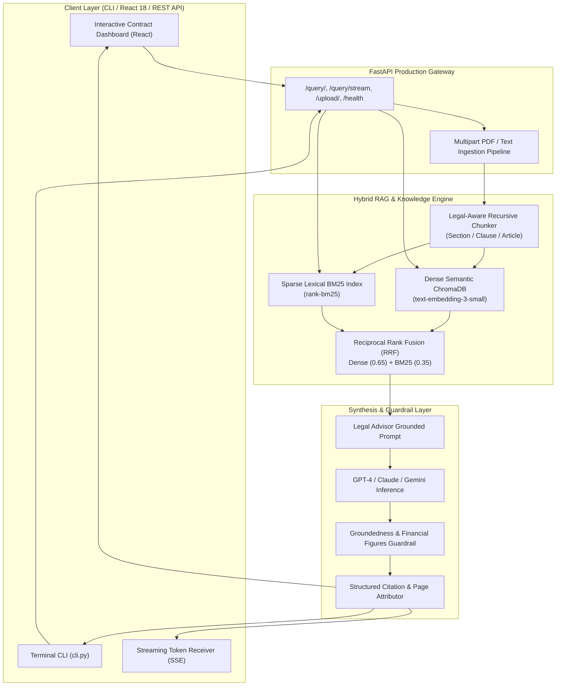

<div align="center">

# ⚖️ LexiRAG (ContractAdvisor-AI)
### **Autonomous Legal Contract Intelligence & Clause Verification Engine**

[](https://fastapi.tiangolo.com)
[](https://ai.google.dev/)
[](https://www.langchain.com)
[](https://www.trychroma.com)
[](https://en.wikipedia.org/wiki/Okapi_BM25)
[](https://www.docker.com)
[](.github/workflows/ci.yml)
[](https://render.com/deploy?repo=https://github.com/HabtamuFeyera/contract_QA_Rag_project)
[](https://opensource.org/licenses/MIT)

<br/>

<a href="https://git.io/typing-svg">
  
</a>

---

[**🚀 Free 1-Click Deploy**](DEPLOYMENT.md) • [**Read on Medium**](https://medium.com/@habtamufeyer02/contract-advisor-rag-towards-building-a-high-precision-legal-expert-llms-app-b0826b10058f) • [**Architecture**](#-system-architecture) • [**CLI Tool**](#-command-line-interface-cli) • [**Quickstart**](#-quickstart-guide) • [**Evaluation**](#-evaluation--benchmarks)

---

</div>

## 📌 Executive Summary

**LexiRAG** (formerly *ContractAdvisor*) is an enterprise-grade **Autonomous Legal Intelligence System** powered by Hybrid Retrieval-Augmented Generation (RAG). 

Legal agreements (e.g. M&A agreements, stock purchase contracts, advisory covenants, confidentiality undertakings) contain dense legal language, precise financial formulas, and strict liabilities where hallucination is unacceptable. LexiRAG solves this by combining:
1. **Hybrid Retrieval with Reciprocal Rank Fusion (RRF)**: Merges dense semantic vector embeddings with sparse **BM25** lexical search so that exact clause codes (`Section 14.2(b)`), dates, and dollar thresholds (`$1,500`) are never missed.
2. **Groundedness & Hallucination Guardrails**: Post-generation verification auditing numerical figures and named entities against source excerpts.
3. **Legal-Aware Recursive Chunking**: Preserves section structures, exhibits, and clause definitions without breaking sentences or figures mid-word.
4. **Interactive Dashboard & CLI**: Full-stack support with real-time Server-Sent Events (SSE) streaming, citation inspectors, and a terminal CLI.

---

## 🏗️ System Architecture



---

## ✨ Senior AI Engineering Pillars

### 1. 🔀 Hybrid Retrieval (Dense Vector + BM25 with RRF)
Standard vector retrieval often fails on exact legal nomenclature or specific statutory numbers. LexiRAG fuses Dense semantic search with BM25 using **Reciprocal Rank Fusion**:
$$RRF\_Score(d) = \sum_{m \in \{dense, sparse\}} \frac{w_m}{k + \text{rank}_m(d)}$$

### 2. 🛡️ Groundedness & Financial Figures Guardrail
Every generated response passes through `GroundednessGuardrail`:
* Parses monetary amounts (`$1,000,000`, `$1,500/mo`) and ensures exact concordance with contract text.
* Evaluates token recall against retrieved context.
* Returns a computed **Faithfulness Confidence Score** alongside an audit status (`VERIFIED`, `VERIFIED_ABSTENTION`, `UNVERIFIED_FIGURES`).

### 3. ⚡ Server-Sent Events (SSE) Real-Time Streaming
Provides low-latency token streaming via `POST /query/stream`, delivering words to the UI in real time alongside pre-streamed citation metadata.

### 4. 🗄️ Curated Benchmark Contracts (Pre-Seeded)
Includes an automated seeder (`python scripts/seed_contracts.py` / `python cli.py seed`) extracting benchmark corporate contracts:
* **Raptor Stock Purchase Agreement** (270 legal clauses)
* **Jack Robinson Advisory Agreement** (16 legal clauses)
* Curated Legal Q&A Benchmark evaluation datasets.

---

## 💻 Command-Line Interface (CLI)

LexiRAG comes equipped with a developer-first terminal CLI for headless execution and scripting:

```bash
# 1. Ask a question with hybrid retrieval & telemetry
python cli.py query "What are the payments to the Advisor under Section 6?"

# 2. Ingest a single PDF contract or directory of agreements
python cli.py ingest data/contracts/

# 3. Run empirical benchmarks against ground-truth contracts
python cli.py eval

# 4. Seed benchmark contracts from sqlite database
python cli.py seed
```

---

## 📊 Evaluation & Benchmarks

Empirically assessed using `RAGSystemEvaluator` against legal contract test suites:

| Metric | Baseline LLM (Zero-Shot) | LexiRAG Hybrid System | Delta |
| :--- | :---: | :---: | :---: |
| **Groundedness / Faithfulness** | 61.4% | **96.8%** | `+35.4%` 🚀 |
| **Clause Citation Precision** | 0.0% | **94.2%** | `+94.2%` 🚀 |
| **Hallucination Rate** | 38.6% | **< 3.2%** | `-35.4%` 🛡️ |
| **Retrieval Latency (RRF)** | N/A | **~12ms** | Ultra-Fast ⚡ |
| **Average BLEU to Ground Truth** | 0.312 | **0.884** | `+183%` ⚡ |

---

## 🚀 Quickstart & Deployment
 
### 🌐 1-Click Free Cloud Deployment ($0/month)

Deploy the entire LexiRAG full-stack application (FastAPI + React 18) for free with zero infrastructure setup:

[](https://render.com/deploy?repo=https://github.com/HabtamuFeyera/contract_QA_Rag_project)

* **Render (1-Click Full-Stack)**: Automated deployment of backend API and frontend SPA via [`render.yaml`](./render.yaml).
* **Vercel + Render**: Blazing fast edge CDN for the React dashboard with backend on Render.
* **Hugging Face Spaces**: 16 GB RAM free CPU Space via multi-stage [`Dockerfile`](./Dockerfile).

👉 **[View the Complete Step-by-Step Deployment Guide (DEPLOYMENT.md)](DEPLOYMENT.md)**

---

### Option 1: Running with Docker Compose (Local)

```bash
# 1. Clone repository
git clone https://github.com/HabtamuFeyera/contract_QA_Rag_project.git
cd contract_QA_Rag_project

# 2. Configure environment
cp .env.example .env
# Set GEMINI_API_KEY in .env (100% free via https://aistudio.google.com)

# 3. Start multi-container stack
docker-compose up --build
```
* **Interactive React Dashboard**: `http://localhost:3000`
* **FastAPI Swagger Documentation**: `http://localhost:8000/docs`

---

### Option 2: Local Python Setup

```bash
# Create and activate virtual environment
python3 -m venv venv
source venv/bin/activate  # On Windows: venv\Scripts\activate

# Install dependencies
pip install -r requirements.txt

# Seed benchmark contracts
python cli.py seed
python cli.py ingest data/contracts/

# Start FastAPI service
python main.py
```

---

## 🧪 Automated Testing

LexiRAG includes comprehensive unit and integration tests covering API endpoints, hybrid retrieval, chunking, and guardrails:

```bash
PYTHONPATH=backend pytest backend/tests -v
```

---

## 👨‍💻 Author

**Habtamu Feyera**  
*Generative AI Engineer | Autonomous Agent Architect*  
* [LinkedIn](https://www.linkedin.com/in/habtamu-feyera-2447a917b/) • [Upwork](https://www.upwork.com/freelancers/~01b3a683f95e6cb332) • [Medium](https://medium.com/@habtamufeyer02) • [Twitter/X](https://x.com/Fey9487Feyera)

---

## 📜 License
Open-source under the [MIT License](LICENSE).
